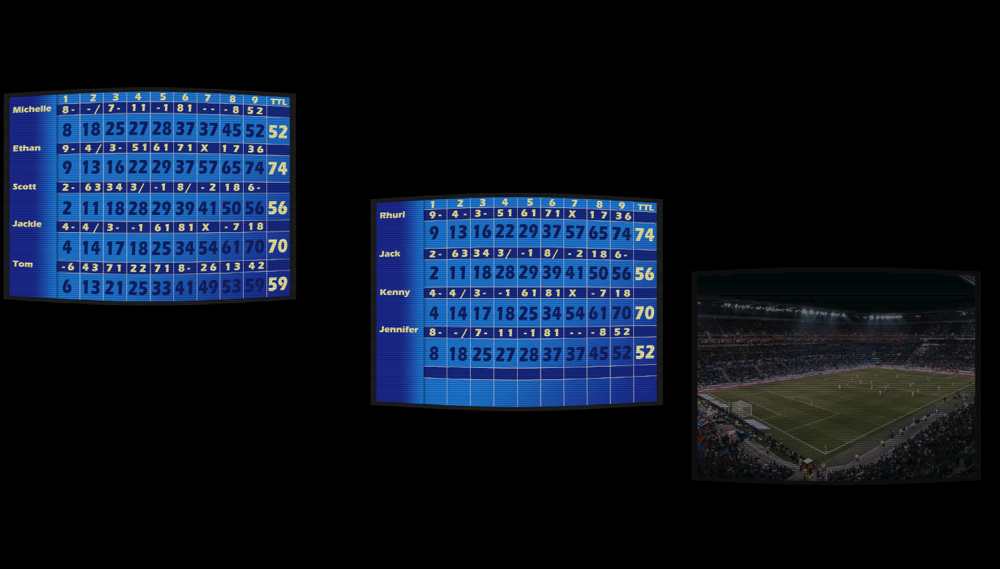

# Gutter Engine: Programmable 3D Game Engine with Realistic Physics and Rendering

## Presentation

This project is a homemade 3D game engine written in C++, integrating notably:

- Realistic rendering with a custom PBR shader, using the OpenGL library
- Realistic physics with the PhysX library
- An optimized and modern architecture in Entity-Component-System (ECS)
- A dynamic interface in ImGui
- A programming system and external API to easily script independent games
- A handmade serialization system for saving

## Context

This project is part of a major academic end-of-cycle engineering project. It is developed by:

- Guillaume Assailly  
- Evahn Le Gal  
- Nathan Meguin  
- Antoine Mura  
- Antoine Viton  

The goal was to create a complete and realistic game engine, to allow the creation of independent games, with the intention of producing a demo game in addition to the engine, which would be a bowling simulation.

## Architecture Choice

From the beginning of the project, we chose an ECS (Entity-Component-System) architecture, a structure increasingly used in the 3D industry, which has become a necessary standard in most game engines.

Other methods of structuring game engines are based on the game objects themselves, which can be complex, numerous, and even changing over time (for example, an element to which a light is added, or another to which physics is added), making their manipulation, storage, and access costly in memory and time.

The principle of ECS is to abstract these flaws, and to define an object not as a full entity, but as a simple identifier, which allows retrieving each of its components (textures, position, rotation, scale, physics, lights, etc.) in optimized arrays. This allows, among other things, optimized addition and evolution of components, simplified management of a large number of objects, and storing only the necessary components of an element.

In our case, we manipulate:

- The transform (position + rotation + scale) of an object
- The rendering if it is visible and has a texture (as well as its complex mesh for display)
- The physics if the object interacts with the world, both static and dynamic for optimization (and the approximated mesh for lighter physics calculations)
- The camera, if the object can be a viewpoint for the player
- The light emission, with different modes and parameters

For example, the player has no rendering because they cannot see themselves, and the pins have a camera to choose fun replay effects, but we could also imagine that the lane emits light as a special effect. All this is configurable in the engine interface.

## Rendering

### Shader and PBR

The engine uses the GLTF format for storing 3D objects, because it supports PBR (Physical Based Rendering) materials, which is very important to obtain a photorealistic rendering. To read these files, we use the Assimp library (Open Asset Import Library).

Once the object is loaded and stored as VAO (Vertex Array Object), VBO (Vertex Buffer Object), and EBO (Element Buffer Object), we can pass it through the different stages of OpenGL rendering with all associated shaders and get a result on screen. These shaders take the textures of the 3D objects and are able to render both a color for a point of a given object, and also all the additional subtleties that constitute PBR, such as:

- Surface imperfections, managed by a normal map and using the scene's light sources  
  

- Light emission, not as an independent source, but simulating a screen, a neon, etc. This uses an emissive map  
  

- Ambient occlusion for permanent shadows in very closed areas, using an AO map  
  

- Metalness and roughness, both determined by the same metalness map, which defines the intensity and dispersion of light reflection, allowing to simulate the difference between metal and plastic  
  

### Dynamic Lights

The engine has 3 types of lights when the light component is associated with an object (not counting the emissive map which is part of the texture and not the light component), whose colors and intensities can be changed:

- Point light, that is a fixed point from which rays go in all directions
- Spot light, which sends rays only in a defined cone, configurable with a direction and an angle
- Directional light, which simulates a source infinitely far away and sends parallel rays over the whole scene, with a configurable angle

We also simulate specular light, that is the reflection of a surface if the light is very concentrated in one direction. This light, unlike the others, requires the view information of the scene, so the active camera.

### Shadows and Planar Reflections

The engine also generates a depth map, that is the projection on the ground of the scene's objects for a given light. Once all are produced, these depth maps are processed to give shadows.

We also manage reflective surfaces, with different coefficients for blur or aberration options. By rendering the scene several times in optimized ways, we can obtain this result that makes the scene much more realistic.

## Interface

The interface was made with ImGui. Among the different panels, we find:

- The list of scene entities
- The inspector to view and modify the parameters of the selected object
- Engine settings, such as displaying a grid/world reference, the gizmo, physics, or the game itself
- Active camera management
- The panel to create new objects in the engine itself
- The shadow map
- The FPS counter

## Physics

We chose the PhysX library from NVIDIA, widely used and well optimized, especially for NVIDIA hardware.

Physics is based on a system of dynamic and static elements, that is elements on which forces can be applied and those that are immutable environments. We define the lane as static for calculation simplicity, and the pins and ball as dynamic.

We use a loop that, every time step, recalculates all physical entities and their collisions to update their positions and forces.

When importing an object for the first time to give it physics, the engine takes time to calculate the convex version of this shape, because PhysX can only use convex shapes for dynamic objects. The algorithm used is VHACD (Volumetric Hierarchical Approximate Convex Decomposition), and once the processing is done, the objects can be used in the scene.

  
   
  <em>Left: PhysX approximation / Right: VHACD algorithm</em>

## Game Programming

The engine has a system to program your own games, without interacting even once with the engine code. The engine provides an API, and by defining game states, we can access this API in the C++ files we create to program. The API offers all the functions to interact with:

- Time and timers
- Object positions
- Their rotations
- Scene cameras
- Keyboard/controller inputs
- Physics and forces applied to objects
- Game states for custom behaviors depending on situations
- And automatic random generators

Even though these are C++ files, it's quite close to scripting and allows behaviors based on "if … then …", to build games based on physics and action sequences.

Finally, the engine uses a mask system for input management: we define in the script the "actions" to which we associate one or more keys, and all this can be modified in the game itself so the player can configure their inputs. This also allows supporting multiple devices, for example keyboard AND controller keys taken into account at the same time, with support for multiple controllers simultaneously and the possibility to plug/unplug controllers at runtime without restarting anything.

